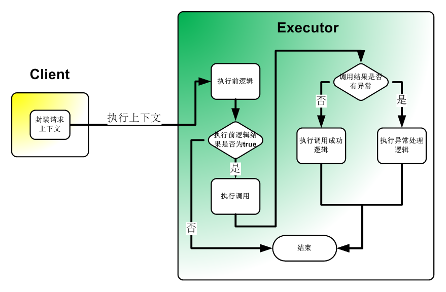
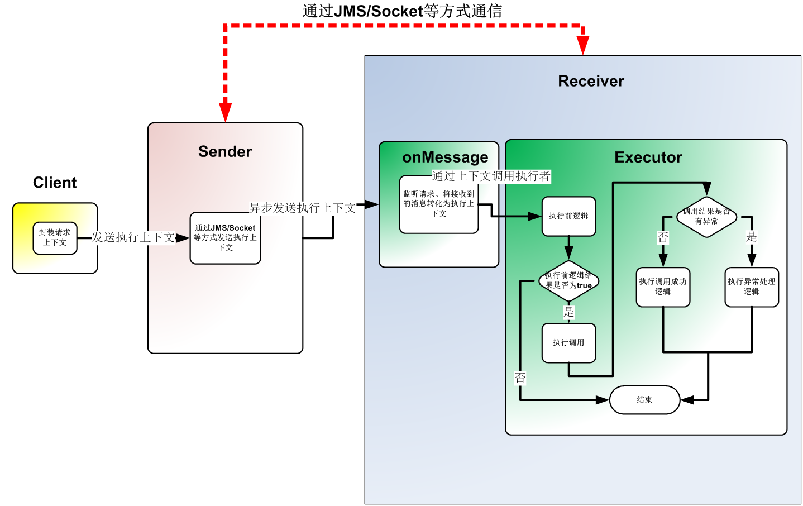

# WebService 简要介绍

## Server Side

### 服务接口 `HelloService.java`

```java
@WebService(serviceName = "HelloService", targetNamespace = "http://www.harmony.com/hi")
public interface HelloService {

    @WebMethod
    @WebResult(name = "result")
    String sayHi(@WebParam(name = "name") String name);

}
```

### 服务实现 `HelloWebService.java`
```java
@WebService(serviceName = "HelloService", targetNamespace = "http://www.harmony.com/hi")
public class HelloWebService implements HelloService {

    @Override
    @WebResult(name = "result")
    public String sayHi(@WebParam(name = "namea") String name) {
        return "Hi " + name;
    }

}
```
### 使用JDK自带方式发布Web服务
```java
public class ServerPublishTest {

    private static final String ADDRESS = "http://localhost:8080/hi";

    public static void main(String[] args) {
        String address = ADDRESS;
        if (args.length > 0) {
            address = args[0];
        }
        // JAXWS way, if other javax.xml.ws.spi.Provider in classpath will do provider way
        // for example: cxf -> org.apache.cxf.jaxws22.spi.ProviderImpl
        Endpoint.publish(address, new HelloWebService());

        /*
        // Publish WebService in CXF way
        JaxWsServerFactoryBean serverFactoryBean = new JaxWsServerFactoryBean();
        serverFactoryBean.setAddress(ADDRESS);
        serverFactoryBean.setServiceClass(HelloWebService.class);
        // or set service bean
        // serverFactoryBean.setServiceBean(new HelloWebService());
        serverFactoryBean.create();
        */
    }
}
```

## JAX-WS

### 使用JDK自带的命令行生成客户端代码
```
$ wsimport -encoding utf-8 -p com.harmony.test.ws -keep http://localhost:8080/hi?wsdl
正在解析 WSDL...

正在生成代码...

正在编译代码...

$
```
[生成的代码](docs/jaxws/com/harmony/test/ws)

```java
@Test
public void testJAXWS() throws Exception {
    // url指向文件
    Service service = Service.create(new URL("http://localhost:8080/hi?wsdl"), new QName("http://www.harmony.com/test/hi", "HelloService"));
    HelloService helloService = service.getPort(HelloService.class);
    assertEquals("Hi wuxii", helloService.sayHi("wuxii"));
}
```

## 使用Apache CXF

### 使用CXF [wsdl2java](http://cxf.apache.org/docs/wsdl-to-java.html) 扩展命令生产客户端文件
```
$ wsdl2java -p com.harmony.test.ws -encoding utf-8 http://localhost:8080/hi?wsdl

$
```
[生成的代码](docs/cxf/com/harmony/test/ws)

```java
@Test
public void testCXF() {
    JaxWsProxyFactoryBean factoryBean = new JaxWsProxyFactoryBean();
    factoryBean.setAddress(ADDRESS);
    HelloService helloService = factoryBean.create(HelloService.class);
    assertEquals("Hi wuxii", helloService.sayHi("wuxii"));
}
```

### 封装使用

#### 封装工具类[`JaxWsProxyBuilder`](src/main/java/com/harmony/umbrella/ws/jaxws/JaxWsProxyBuild.java)

```java
@Test
public void test() {
    HelloService helloService = JaxWsProxyBuilder.create()//
                                                 .setAddress(ADDRESS)//
                                                 .build(HelloService.class);
    assertEquals("Hi wuxii", helloService.sayHi("wuxii"));
}
```

# 扩展功能介绍

## 抽象调用过程

&nbsp;&nbsp;&nbsp;&nbsp;通过抽象调用过程，将调用所需要的数据作为参数(执行上下文)。来实现客户端通过组装执行上下文来实现交互，亦可通过JMS等方式将执行上下文发送到JMS容器来执行最终的调用。该部分扩展统一了调用的入口便于接口的扩展与调用的追溯。

### 直接调用



### 生产消费模式调用



## 使用扩展功能

### 核心API

#### [`com.harmony.umbrella.ws.Context`](src/main/java/com/harmony/umbrella/ws/Context.java)

执行时候的上下文，上下文中包括：
* 待执行的web service接口
* 待执行的方法
* 执行时候所需要用到的参数
* 调用地址
* 用户名密码
* 以及其他待扩展的属性

#### [`com.harmony.umbrella.ws.jaxws.JaxWsExecutor`](src/main/java/com/harmony/umbrella/ws/jaxws/JaxWsExecutor.java)

执行交互执行者：
* `Object execute(Context)`同步执行交互
* `Future<?> executeAsync(Context)`异步执行交互

#### [`com.harmony.umbrella.ws.PhaseVisitor`](src/main/java/com/harmony/umbrella/ws/PhaseVisitor.java)

对JaxWsExecutor的各个执行周期的访问控制
* `visitBefore(Context)` 执行前被调用
* `visitAbort(WebServiceAbortException, Context)`执行取消被调用
* `visitCompletion(Object, Context)`执行完成被调用
* `visitThrowing(Throwable, Context)`执行有异常被调用

#### 客户端逻辑与调用的分离

[`com.harmony.umbrella.ws.Phase`](src/main/java/com/harmony/umbrella/ws/Phase.java)

[`com.harmony.umbrella.ws.annotation.Handler`](src/main/java/com/harmony/umbrella/ws/Handler.java)

[`com.harmony.umbrella.ws.annotation.Handler.HandleMethod`](src/main/java/com/harmony/umbrella/ws/Handler.java)

[`com.harmony.umbrella.ws.visitor.PhaseValidationVisitor`](src/main/java/com/harmony/umbrella/ws/visitor/PhaseValidationVisitor.java)

```java
public class JaxWsExecutorAndPhaseValTest {

    private static final String address = "http://localhost:8081/hello";
    private static final JaxWsExecutor executor = new JaxWsCXFExecutor();

    private static int count = 0;

    @BeforeClass
    public static void setUp() {
        // 发布HelloWebService服务在地址http://localhost:8081/hello上
        JaxWsServerBuilder.create().publish(HelloWebService.class, address);
    }

    @Test
    public void testHelloServicePhaseVal() {
        // 设置接口调用的上下文(服务接口, 服务方法名, 服务的参数)
        SimpleContext context = new SimpleContext(HelloService.class, "sayHi", new Object[]{"wuxii"});
        // 设置服务的所在地址
        context.setAddress(address);
        // 调用执行者执行方法， PhaseValidationVisitor用于帮助加载HelloServiceSayHiPhaseValidation实例进行接口的执行周期检验
        Object result = executor.execute(context, new PhaseValidationVisitor());
        // 对结果进行断言判断
        assertNotNull(result);
        assertEquals("Hi wuxii", result);
        assertEquals(2, count);
    }

    /**
     * 接口客户端的周期检验类
     * ps:该类拦截了{@linkplain HelloService#sayHi(String)}方法
     * 将调用分解为 前-(取消)-后-异常
     *
     * @author wuxii@foxmail.com
     */
    // @Handler注解表明这个类拦截接口HelloService的执行
    @Handler(HelloService.class)
    public static class HelloServiceSayHiPhaseValidation {

        /**
         * 在调用接口{@linkplain HelloService#sayHi(String)}前拦截调用
         *
         * @param message
         *         客户端情求时候的参数
         * @param content
         *         上下文中用户设置的内容
         * @return true表示交互可以继续执行， false交互将被终止
         */
        // Phase.PRE_INVOKE 表明执行前调用
        @HandleMethod(phase = Phase.PRE_INVOKE)
        public boolean sayHi(String message, Map<String, Object> content) {
            count++;
            return true;
        }

        /**
         * 在调用被取消时候调用
         *
         * @param exception
         *         取消异常
         * @param message
         *         客户端情求时候的参数
         * @param content
         *         上下文中用户设置的内容
         */
        @HandleMethod(phase = Phase.ABORT)
        public void sayHi(WebServiceAbortException exception, String message, Map<String, Object> content) {
        }

        /**
         * 在调用成功时候被调用
         *
         * @param result
         *         接口返回的结果
         * @param message
         *         请求的参数
         * @param content
         *         用户设置的上下文内容
         */
        @HandleMethod(phase = Phase.POST_INVOKE)
        public void sayHi(String result, String message, Map<String, Object> content) {
            count++;
        }

        /**
         * 在调用异常时候被调用
         *
         * @param e
         *         异常信息
         * @param message
         *         请求参数
         * @param content
         *         用户设置的上下文
         */
        @HandleMethod(phase = Phase.THROWING)
        public void sayHi(Throwable e, String message, Map<String, Object> content) {
        }

    }

}
```
执行的控制台输出
```
[INFO] 07/27 23:25:34,607 .buildServiceFromClass(ReflectionServiceFactoryBean.java:434) - Creating Service {http://www.harmony.com/test/hi}HelloService from class com.harmony.umbrella.ws.services.HelloService
[INFO] 07/27 23:25:34,998 .initDestination(ServerImpl.java:85) - Setting the server's publish address to be http://localhost:8081/hello
[INFO] 07/27 23:25:35,018 .doStart(Server.java:272) - jetty-8.1.15.v20140411
[INFO] 07/27 23:25:35,073 .doStart(AbstractConnector.java:338) - Started SelectChannelConnector@localhost:8081
[INFO] 07/27 23:25:35,180 .getAllHandlerClass(HandlerMethodFinder.java:99) - all @Handler classes [class com.harmony.umbrella.ws.jaxws.JaxWsExecutorAndPhaseValTest$HelloServiceSayHiPhaseValidation]
[INFO] 07/27 23:25:35,185 .buildServiceFromClass(ReflectionServiceFactoryBean.java:434) - Creating Service {http://www.harmony.com/test/hi}HelloService from class com.harmony.umbrella.ws.services.HelloService
[INFO] 07/27 23:25:35,199 .executeQuite(JaxWsCXFExecutor.java:63) - 使用代理[org.apache.cxf.jaxws.JaxWsClientProxy@61eaec38]执行交互{
  address  <-> http://localhost:8081/hello
  methodId <-> com.harmony.umbrella.ws.services.HelloService#sayHi(java.lang.String)
  username <-> null
  password <-> null
  ctimeout <-> -1
  rtimeout <-> -1
  stimeout <-> -1
}, invoker is [com.harmony.umbrella.ws.util.JaxWsInvoker@125290e5]
[INFO] 07/27 23:25:35,484 .executeQuite(JaxWsCXFExecutor.java:82) - 执行情况概要如下:{
  id:com.harmony.umbrella.ws.services.HelloService#sayHi(java.lang.String)
  requestTime:2015-07-27 23:25:35:200
  use:284
  arguments:{1:wuxii}
  result:Hi wuxii
  exception:false
}
```
#### 实用性扩展

[`com.harmony.umbrella.ws.jaxws.JaxWsCXFExecutor`](src/main/java/com/harmony/umbrella/ws/jaxws/JaxWsCXFExecutor.java)
执行者的CXF实现

[`com.harmony.umbrella.ws.Metadata`](src/main/java/com/harmony/umbrella/ws/Metadata.java)
用户名密码等元数据

[`com.harmony.umbrella.ws.MetadataLoader`](src/main/java/com/harmony/umbrella/ws/MetadataLoader.java)
元数据等加载扩展

[`com.harmony.umbrella.ws.jaxws.support.JaxWsContextReceiver`](src/main/java/com/harmony/umbrella/ws/jaxws/support/JaxWsContextReceiver.java)
执行上下文分离的接收扩展

[`com.harmony.umbrella.ws.jaxws.support.JaxWsContextSender`](src/main/java/com/harmony/umbrella/ws/jaxws/support/JaxWsContextSender.java)
执行上下文的分离发送扩展

# 基于业务的扩展

## 业务上的扩展

在实际业务中能明确出是哪个业务需要调用哪个接口的具体哪个方法，所以给出以下扩展：

### [`com.harmony.dark.ws.Syncable`](src/main/java/com/harmony/dark/ws/Syncable.java)

用于标注业务bean的注解

* `Class<?> endpoint()` 要调用的服务接口
* `String methodName()` 要调用的服务方法
* `String address() default ""` 服务的所在地址
* `boolean callback() default true` 是否开启业务回调

### [`com.harmony.dark.ws.SyncCallback`](src/main/java/com/harmony/dark/ws/SyncCallback.java)

业务回调接口
* `void forward(T)` 服务的前置方法
* `<R> void success(T, R)` 服务执行成功的回调方法
* `void failed(T, Throwable)` 服务执行失败的回调方法

### [`com.harmony.dark.ws.ProxyHandler`](src/main/java/com/harmony/dark/ws/ProxyHandler.java)

客户端的基础入口接口， 提供了一些基本的实体同步方法
* `boolean sync(T)` 同步单个对象
* `void sync(Iterable)` 将对象遍历同步(一个一个的同步)
* `boolean syncInBatch(Iterable)`将所有的对象在一次同步操作中同步

### [`com.harmony.dark.ws.AbstractProxyHandler`](src/main/java/com/harmony/dark/ws/proxy/ProxySupport.java)

为实现`SyncCallback`、`@Syncable`功能做的基础抽象类

### [`com.harmony.dark.ws.visitor.SyncablePhaseVisitor`](src/main/java/com/harmony/dark/ws/visitor/SyncablePhaseVisitor.java)

用于动态加载标有`@Syncable`的`SyncCallback`回调业务Bean

## 对业务扩展的使用

### 服务前提条件

#### 1. 接口VO以及实体

这边假设`BusUser`为实体`User`为VO

```java
public class BusUser implements Serializable {

    private static final long serialVersionUID = -7009274614672212482L;

    private String userCode;

    public BusUser() {
    }

    public BusUser(String userCode) {
        this.userCode = userCode;
    }

    public String getUserCode() {
        return userCode;
    }

    public void setUserCode(String userCode) {
        this.userCode = userCode;
    }

    @Override
    public String toString() {
        return "{\"userCode\":\"" + userCode + "\"}";
    }

}

public class User implements Serializable {

    private static final long serialVersionUID = 1950532032126574719L;

    private String name;

    public User() {
    }

    public User(String name) {
        this.name = name;
    }

    public String getName() {
        return name;
    }

    public void setName(String name) {
        this.name = name;
    }

}
```

#### 2. 服务部分

此服务共有两个操作，同步`User`以及获取`User`

```java
@WebService(serviceName = "UserService", targetNamespace = "http://www.umbrella.com/user")
public interface UserService {

    Message saveUser(@WebParam(name = "user") User user);

    User findUser(@WebParam(name = "name") String name);

}

@WebService(serviceName = "UserService", targetNamespace = "http://www.umbrella.com/user")
public class UserWebService extends AbstractServerHandler implements UserService {

    private static final List<User> users = new ArrayList<User>();

    public Message saveUser(@WebParam(name = "user") User user) {
        MessageContent content = createContent();
        if (isValid(user, content)) {
            return error(content);
        }
        users.add(user);
        return success(content);
    }

    public User findUser(@WebParam(name = "name") String name) {
        for (User user : users) {
            if (name != null && name.equals(user.getName())) {
                return user;
            }
        }
        return null;
    }

}
```

#### 3. 同步的业务Bean以及回调Bean

`BusUserProxyHandlerBean`同时实现了`SyncCallback`，`ProxyHandler`接口。即使同步的业务Bean也是同步的回调Bean

```java
@Stateless(mappedName = "BusUserProxyHandlerBean")
@Remote({ SyncCallback.class, ProxyHandler.class })
@Syncable(endpoint = UserService.class, methodName = "saveUser", address = ProxyHandlerTest.address)
public class BusUserProxyHandlerBean extends AbstractProxyHandler<BusUser> implements SyncCallback<BusUser>, ProxyHandler<BusUser> {

    private static final Logger log = LoggerFactory.getLogger(BusUserProxyHandlerBean.class);

    @EJB
    private JaxWsContextSender sender;

    @Override
    protected JaxWsContextSender getJaxWsContextSender() {
        return sender;
    }

    @Override
    public void forward(BusUser obj) {
        log.info("forward >> {}", obj);
    }

    @Override
    public void success(BusUser obj, Object result) {
        log.info("success >> {}, result >> {}", obj, result);
    }

    @Override
    public void failed(BusUser obj, Throwable throwable) {
        log.info("success >> {}, throwable >> {}", obj, throwable);
    }

    @Override
    protected Object[] packing(BusUser obj) {
        return new Object[] { new User(obj.getUserCode()) };
    }

}
```

### 测试类

#### [`ProxyHandlerTest`](src/test/java/com/harmony/dark/ws/ProxyHandlerTest.java)

```java
public class ProxyHandlerTest {

    public static final String address = "http://localhost:8080/user";

    public static EJBContainer container;

    @EJB
    private ProxyHandler<BusUser> busProxy;

    @BeforeClass
    public static void beforeClass() throws Exception {
        // 发布服务
        ServerManager.getServerManager().publish(UserWebService.class, address);

        Properties props = new Properties();
        // JMS资源
        props.put("MyJmsResourceAdapter", "new://Resource?type=ActiveMQResourceAdapter");
        props.put("MyJmsResourceAdapter.BrokerXmlConfig", "broker:(tcp://localhost:61616)?useJmx=false");
        props.put("MyJmsResourceAdapter.ServerUrl", "tcp://localhost:61616");

        props.put("MyJmsMdbContainer", "new://Container?type=MESSAGE");
        props.put("MyJmsMdbContainer.ResourceAdapter", "MyJmsResourceAdapter");

        props.put("jms.connectionFactory", "new://Resource?type=QueueConnectionFactory");
        props.put("jms.connectionFactory.ResourceAdapter", "MyJmsResourceAdapter");

        props.put("jms.queue", "new://Resource?type=Queue");
        // 创建EJB环境
        container = EJBContainer.createEJBContainer(props);
    }

    @Before
    public void before() throws Exception {
        container.getContext().bind("inject", this);
    }

    @Test
    public void test() throws Exception {
        // 调用业务bean同步BusUser对象
        busProxy.sync(new BusUser("wuxii"));
        // 由于是异步， 稍微等待
        Thread.sleep(1000 * 2);
        // 断言同步的对象保存到服务当中
        UserService service = JaxWsProxyBuilder.create().build(UserService.class, address);
        assertNotNull(service.findUser("wuxii"));
    }

}
```
```
信息 - ********************************************************************************
信息 - OpenEJB http://openejb.apache.org/
信息 - Startup: Mon Aug 03 13:43:37 CST 2015
信息 - Copyright 1999-2013 (C) Apache OpenEJB Project, All Rights Reserved.
信息 - Version: 4.7.1
信息 - Build date: 20140912
信息 - Build time: 01:43
信息 - ********************************************************************************
信息 - openejb.home = F:\Workspace\wuxii\dark\dark-ws
信息 - openejb.base = F:\Workspace\wuxii\dark\dark-ws
信息 - Created new singletonService org.apache.openejb.cdi.ThreadSingletonServiceImpl@5fcd892a
信息 - Succeeded in installing singleton service
信息 - Using 'javax.ejb.embeddable.EJBContainer=true'
信息 - Cannot find the configuration file [conf/openejb.xml].  Will attempt to create one for the beans deployed.
信息 - Configuring Service(id=Default Security Service, type=SecurityService, provider-id=Default Security Service)
信息 - Configuring Service(id=Default Transaction Manager, type=TransactionManager, provider-id=Default Transaction Manager)
信息 - Configuring Service(id=MyJmsResourceAdapter, type=Resource, provider-id=Default JMS Resource Adapter)
信息 - Configuring Service(id=jms.connectionFactory, type=Resource, provider-id=Default JMS Connection Factory)
信息 - Configuring Service(id=jms.queue, type=Resource, provider-id=Default Queue)
信息 - Configuring Service(id=MyJmsMdbContainer, type=Container, provider-id=Default MDB Container)
信息 - Creating TransactionManager(id=Default Transaction Manager)
信息 - Creating SecurityService(id=Default Security Service)
信息 - Creating Resource(id=MyJmsResourceAdapter)
信息 - Thread pool size for 'MyJmsResourceAdapter' is (30)
信息 - ActiveMQ5Factory creating broker
信息 - Using ActiveMQ startup timeout of 10000ms
信息 - Starting ActiveMQ BrokerService
[INFO] BrokerService.doStartPersistenceAdapter(BrokerService.java:636) - Using Persistence Adapter: MemoryPersistenceAdapter
[INFO] BrokerService.doStartBroker(BrokerService.java:674) - Apache ActiveMQ 5.10.0 (localhost, ID:wuxii-PC-59363-1438580618607-0:1) is starting
[INFO] TransportServerThreadSupport.doStart(TransportServerThreadSupport.java:69) - Listening for connections at: tcp://127.0.0.1:61616
[INFO] TransportConnector.start(TransportConnector.java:263) - Connector tcp://127.0.0.1:61616 started
[INFO] BrokerService.doStartBroker(BrokerService.java:695) - Apache ActiveMQ 5.10.0 (localhost, ID:wuxii-PC-59363-1438580618607-0:1) started
[INFO] BrokerService.doStartBroker(BrokerService.java:696) - For help or more information please see: http://activemq.apache.org
信息 - Starting ActiveMQ checkpoint
信息 - ActiveMQ broker started
信息 - Creating Resource(id=jms.connectionFactory)
信息 - Creating ConnectionManager for Resource(id=jms.connectionFactory)
[INFO] GenericConnectionManager.<init>(GenericConnectionManager.java:122) - No runtime TransactionSupport
信息 - Creating Resource(id=jms.queue)
信息 - Creating Container(id=MyJmsMdbContainer)
信息 - Found EjbModule in classpath: e:\maven\.m2\repository\com\harmony\umbrella\plugins\message-ee-plugin\0.0.3-snapshot\message-ee-plugin-0.0.3-snapshot.jar
信息 - Found EjbModule in classpath: f:\workspace\wuxii\dark\dark-ws\target\classes
信息 - Found EjbModule in classpath: f:\workspace\wuxii\dark\dark-ws\target\test-classes
信息 - Beginning load: e:\maven\.m2\repository\com\harmony\umbrella\plugins\message-ee-plugin\0.0.3-snapshot\message-ee-plugin-0.0.3-snapshot.jar
信息 - Beginning load: f:\workspace\wuxii\dark\dark-ws\target\classes
信息 - Beginning load: f:\workspace\wuxii\dark\dark-ws\target\test-classes
信息 - Configuring enterprise application: F:\Workspace\wuxii\dark\dark-ws
信息 - Auto-deploying ejb ApplicationMessageSender: EjbDeployment(deployment-id=ApplicationMessageSender)
信息 - Auto-deploying ejb ApplicationMessageListener: EjbDeployment(deployment-id=ApplicationMessageListener)
信息 - Auto-deploying ejb JaxWsContextSenderBean: EjbDeployment(deployment-id=JaxWsContextSenderBean)
信息 - Auto-deploying ejb JaxWsContextReceiverBean: EjbDeployment(deployment-id=JaxWsContextReceiverBean)
信息 - Auto-deploying ejb BusUserProxyHandlerBean: EjbDeployment(deployment-id=BusUserProxyHandlerBean)
信息 - Configuring Service(id=Default Stateless Container, type=Container, provider-id=Default Stateless Container)
信息 - Auto-creating a container for bean ApplicationMessageSender: Container(type=STATELESS, id=Default Stateless Container)
信息 - Creating Container(id=Default Stateless Container)
信息 - Auto-linking resource-ref 'java:comp/env/com.harmony.umbrella.message.ApplicationMessageSender/connectionFactory' in bean ApplicationMessageSender to Resource(id=jms.connectionFactory)
信息 - Auto-linking resource-ref 'java:comp/env/com.harmony.umbrella.message.ApplicationMessageSender/destination' in bean ApplicationMessageSender to Resource(id=jms.queue)
信息 - Configuring Service(id=Default Managed Container, type=Container, provider-id=Default Managed Container)
信息 - Auto-creating a container for bean com.harmony.dark.ws.ProxyHandlerTest: Container(type=MANAGED, id=Default Managed Container)
信息 - Creating Container(id=Default Managed Container)
信息 - Using directory C:\Users\wuxii\AppData\Local\Temp for stateful session passivation
信息 - Enterprise application "F:\Workspace\wuxii\dark\dark-ws" loaded.
信息 - Assembling app: F:\Workspace\wuxii\dark\dark-ws
[INFO] Version.<clinit>(Version.java:27) - HV000001: Hibernate Validator 5.1.3.Final
[INFO] ConfigurationImpl.parseValidationXml(ConfigurationImpl.java:344) - HV000002: Ignoring XML configuration.
[INFO] ConfigurationImpl.parseValidationXml(ConfigurationImpl.java:344) - HV000002: Ignoring XML configuration.
[INFO] ConfigurationImpl.parseValidationXml(ConfigurationImpl.java:344) - HV000002: Ignoring XML configuration.
[INFO] ConfigurationImpl.parseValidationXml(ConfigurationImpl.java:344) - HV000002: Ignoring XML configuration.
信息 - Jndi(name="java:global/message-ee-plugin-0.0.3-SNAPSHOT/ApplicationMessageSender!com.harmony.umbrella.message.MessageSender")
信息 - Jndi(name="java:global/message-ee-plugin-0.0.3-SNAPSHOT/ApplicationMessageSender")
信息 - Jndi(name="java:global/dark-ws/JaxWsContextSenderBean!com.harmony.umbrella.ws.jaxws.support.JaxWsContextSender")
信息 - Jndi(name="java:global/dark-ws/JaxWsContextSenderBean")
信息 - Jndi(name="java:global/dark-ws/JaxWsContextReceiverBean!com.harmony.umbrella.message.MessageResolver")
信息 - Jndi(name="java:global/dark-ws/JaxWsContextReceiverBean!com.harmony.umbrella.ws.jaxws.support.JaxWsContextReceiver")
信息 - Jndi(name="java:global/dark-ws/JaxWsContextReceiverBean")
信息 - Jndi(name="java:global/dark-ws/BusUserProxyHandlerBean!com.harmony.dark.ws.SyncCallback")
信息 - Jndi(name="java:global/dark-ws/BusUserProxyHandlerBean!com.harmony.dark.ws.ProxyHandler")
信息 - Jndi(name="java:global/dark-ws/BusUserProxyHandlerBean")
信息 - Existing thread singleton service in SystemInstance(): org.apache.openejb.cdi.ThreadSingletonServiceImpl@5fcd892a
信息 - OpenWebBeans Container is starting...
信息 - Adding OpenWebBeansPlugin : [CdiPlugin]
信息 - All injection points were validated successfully.
信息 - OpenWebBeans Container has started, it took 99 ms.
信息 - Created Ejb(deployment-id=ApplicationMessageSender, ejb-name=ApplicationMessageSender, container=Default Stateless Container)
信息 - Created Ejb(deployment-id=JaxWsContextReceiverBean, ejb-name=JaxWsContextReceiverBean, container=Default Stateless Container)
信息 - Created Ejb(deployment-id=JaxWsContextSenderBean, ejb-name=JaxWsContextSenderBean, container=Default Stateless Container)
信息 - Created Ejb(deployment-id=BusUserProxyHandlerBean, ejb-name=BusUserProxyHandlerBean, container=Default Stateless Container)
[INFO] ActiveMQEndpointWorker.start(ActiveMQEndpointWorker.java:266) - Starting
信息 - Created Ejb(deployment-id=ApplicationMessageListener, ejb-name=ApplicationMessageListener, container=MyJmsMdbContainer)
[INFO] WorkerContext.run(WorkerContext.java:349) - Removing non-required WorkContextHandler with no context: org.apache.geronimo.connector.work.TransactionContextHandler@4dbcc56b
[INFO] WorkerContext.run(WorkerContext.java:349) - Removing non-required WorkContextHandler with no context: org.apache.openejb.core.security.SecurityContextHandler@437b32ac
[INFO] WorkerContext.run(WorkerContext.java:349) - Removing non-required WorkContextHandler with no context: org.apache.geronimo.connector.work.HintsContextHandler@4744ae1b
[INFO] ActiveMQEndpointWorker.run(ActiveMQEndpointWorker.java:104) - Establishing connection to broker [tcp://localhost:61616]
信息 - Started Ejb(deployment-id=ApplicationMessageSender, ejb-name=ApplicationMessageSender, container=Default Stateless Container)
信息 - Started Ejb(deployment-id=JaxWsContextReceiverBean, ejb-name=JaxWsContextReceiverBean, container=Default Stateless Container)
信息 - Started Ejb(deployment-id=JaxWsContextSenderBean, ejb-name=JaxWsContextSenderBean, container=Default Stateless Container)
信息 - Started Ejb(deployment-id=BusUserProxyHandlerBean, ejb-name=BusUserProxyHandlerBean, container=Default Stateless Container)
信息 - Started Ejb(deployment-id=ApplicationMessageListener, ejb-name=ApplicationMessageListener, container=MyJmsMdbContainer)
信息 - Deployed Application(path=F:\Workspace\wuxii\dark\dark-ws)
[INFO] ActiveMQEndpointWorker.run(ActiveMQEndpointWorker.java:151) - Successfully established connection to broker [tcp://localhost:61616]
[INFO] ReflectionServiceFactoryBean.buildServiceFromClass(ReflectionServiceFactoryBean.java:434) - Creating Service {http://www.umbrella.com/user}UserService from class com.harmony.dark.ws.UserService
[INFO] ServerImpl.initDestination(ServerImpl.java:85) - Setting the server's publish address to be http://localhost:8080/user
[INFO] Server.doStart(Server.java:272) - jetty-8.1.15.v20140411
[INFO] AbstractConnector.doStart(AbstractConnector.java:338) - Started SelectChannelConnector@localhost:8080
[INFO] ServerManager.doPublish(ServerManager.java:214) - Publish JaxWs Service {com.harmony.dark.ws.UserWebService@http://localhost:8080/user}
[INFO] WorkerContext.run(WorkerContext.java:349) - Removing non-required WorkContextHandler with no context: org.apache.geronimo.connector.work.TransactionContextHandler@4dbcc56b
[INFO] WorkerContext.run(WorkerContext.java:349) - Removing non-required WorkContextHandler with no context: org.apache.openejb.core.security.SecurityContextHandler@437b32ac
[INFO] WorkerContext.run(WorkerContext.java:349) - Removing non-required WorkContextHandler with no context: org.apache.geronimo.connector.work.HintsContextHandler@4744ae1b
[INFO] CallbackFactory.getCallbackClasses(CallbackFactory.java:106) - com.harmony.dark.ws.UserService.saveUser, all callback [class com.harmony.dark.ws.BusUserProxyHandlerBean]
[INFO] BusUserProxyHandlerBean.forward(BusUserProxyHandlerBean.java:50) - #### forward >> {"userCode":"wuxii"}
[INFO] HandlerMethodFinder.getAllHandlerClass(HandlerMethodFinder.java:99) - all @Handler classes []
[INFO] ReflectionServiceFactoryBean.buildServiceFromClass(ReflectionServiceFactoryBean.java:434) - Creating Service {http://www.umbrella.com/user}UserService from class com.harmony.dark.ws.UserService
[INFO] JaxWsCXFExecutor.executeQuite(JaxWsCXFExecutor.java:65) - 使用代理[org.apache.cxf.jaxws.JaxWsClientProxy@5360a543]执行交互{
  address  <-> http://localhost:8080/user
  methodId <-> com.harmony.dark.ws.UserService#saveUser(com.harmony.dark.ws.vo.User)
  username <-> null
  password <-> null
  ctimeout <-> -1
  rtimeout <-> -1
  stimeout <-> -1
}, invoker is [com.harmony.umbrella.ws.util.JaxWsInvoker@67697a61]
[INFO] MessageInInterceptor.logging(MessageInInterceptor.java:63) - 
--------------------------------------
JaxWs-Server Inbound
--------------------------------------
ID: 1
Encoding: UTF-8
Http-Method: POST
Request-Url: http://localhost:8080/user
Content-Type: text/xml; charset=UTF-8
Headers: {Accept=[*/*], Cache-Control=[no-cache], connection=[keep-alive], Content-Length=[210], content-type=[text/xml; charset=UTF-8], Host=[localhost:8080], Pragma=[no-cache], SOAPAction=[""], User-Agent=[Apache CXF 3.0.2]}
Payload: 
<soap:Envelope xmlns:soap="http://schemas.xmlsoap.org/soap/envelope/">
  <soap:Body>
    <ns2:saveUser xmlns:ns2="http://www.umbrella.com/user">
      <user>
        <name>wuxii</name>
      </user>
    </ns2:saveUser>
  </soap:Body>
</soap:Envelope>
--------------------------------------
[INFO] MessageOutInterceptor.logging(MessageOutInterceptor.java:101) - 
--------------------------------------
JaxWs-Server Outbound
--------------------------------------
ID: 1
Response-Code: 200
Encoding: UTF-8
Content-Type: text/xml
Headers: {}
Payload: 
<soap:Envelope xmlns:soap="http://schemas.xmlsoap.org/soap/envelope/">
  <soap:Body>
    <ns2:saveUserResponse xmlns:ns2="http://www.umbrella.com/user">
      <return>
        <message>S</message>
        <type>操作成功</type>
      </return>
    </ns2:saveUserResponse>
  </soap:Body>
</soap:Envelope>
--------------------------------------
[INFO] JaxWsPhaseExecutor.executeQuite(JaxWsCXFExecutor.java:86) - 执行情况概要如下:{
  id:com.harmony.dark.ws.UserService#saveUser(com.harmony.dark.ws.vo.User)
  requestTime:2015-08-03 13:43:43:125
  use:705
  arguments:{1:com.harmony.dark.ws.vo.User@3725d239}
  result:{type:操作成功, message:S, content:{}}
  exception:false
}
[INFO] BusUserProxyHandlerBean.success(BusUserProxyHandlerBean.java:55) - #### success >> {"userCode":"wuxii"}, result >> {type:操作成功, message:S, content:{}}
[INFO] HandlerMethodFinder.getAllHandlerClass(HandlerMethodFinder.java:99) - all @Handler classes []
[INFO] ReflectionServiceFactoryBean.buildServiceFromClass(ReflectionServiceFactoryBean.java:434) - Creating Service {http://www.umbrella.com/user}UserService from class com.harmony.dark.ws.UserService
[INFO] MessageInInterceptor.logging(MessageInInterceptor.java:63) - 
--------------------------------------
JaxWs-Server Inbound
--------------------------------------
ID: 2
Encoding: UTF-8
Http-Method: POST
Request-Url: http://localhost:8080/user
Content-Type: text/xml; charset=UTF-8
Headers: {Accept=[*/*], Cache-Control=[no-cache], connection=[keep-alive], Content-Length=[197], content-type=[text/xml; charset=UTF-8], Host=[localhost:8080], Pragma=[no-cache], SOAPAction=[""], User-Agent=[Apache CXF 3.0.2]}
Payload: 
<soap:Envelope xmlns:soap="http://schemas.xmlsoap.org/soap/envelope/">
  <soap:Body>
    <ns2:findUser xmlns:ns2="http://www.umbrella.com/user">
      <name>wuxii</name>
    </ns2:findUser>
  </soap:Body>
</soap:Envelope>
--------------------------------------
[INFO] MessageOutInterceptor.logging(MessageOutInterceptor.java:101) - 
--------------------------------------
JaxWs-Server Outbound
--------------------------------------
ID: 2
Response-Code: 200
Encoding: UTF-8
Content-Type: text/xml
Headers: {}
Payload: 
<soap:Envelope xmlns:soap="http://schemas.xmlsoap.org/soap/envelope/">
  <soap:Body>
    <ns2:findUserResponse xmlns:ns2="http://www.umbrella.com/user">
      <return>
        <name>wuxii</name>
      </return>
    </ns2:findUserResponse>
  </soap:Body>
</soap:Envelope>
--------------------------------------
```
